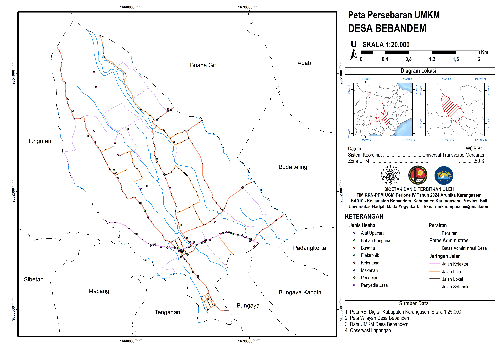

# RBI Map Updating and Historical Map Digitization

## Overview
This project was developed as an individual work program during the Student Community Service-Learning (KKN) program in Bebandem Village. The initiative focuses on providing essential spatial data for village administration by creating thematic maps of land use, MSMEs, and public infrastructure.

## Objectives
- Produce land use maps through detailed digitization of high-resolution satellite imagery
- Map local MSMEs and infrastructure to support community economic development and resource management
- Integrate community knowledge into formal spatial data through participatory mapping techniques

## Study Area
Bebandem Village, Bali, Indonesia

## Software
- ArcGIS
- QGIS
- ArcSurvey123

## Methodology
The spatial data was generated through two primary workflows. The Land Use Map was created by on-screen digitizing using high-resolution satellite imagery to ensure precise land cover classification. Meanwhile, the MSME and Infrastructure Maps were developed using a participatory mapping approach, where data was collected through direct field surveys and community engagement. All collected data were then processed into structured GIS layers to provide a comprehensive spatial overview of the village.

## Map Preview

  
   
  <em>MSME Map</em>

## Academic Context
This project was developed as an individual work program during the Student Community Service-Learning (KKN) program, located in Bebandem Village, Bali. While part of a larger multidisciplinary team, this specific mapping and spatial analysis initiative was independently executed to provide data-driven solutions for the local community.

## Author
Aisyah Nasywa Talitha (GIS and Remote Sensing Enthusiast) 🤝Big thanks to all my Bebandem teams for our amazing works!