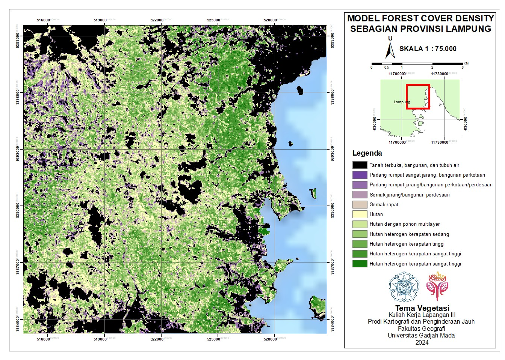

# Forest Cover Density Analysis for Landscape Ecology Mapping

## Overview
This project using Landsat 8 imagery and Forest Cover Density (FCD) model to map landscape ecology, by integrating vegetation density from FCD model and land unit map (Combination of soil, rock, and relief map).

## Objectives
- Map the landscape ecology
- Analyze vegetation structure for each landscape unit
- Using Forest Cover Density (FCD) model to identify the vegetation structure

## Study Area
Lampung Province, Indonesia

## Software
- ArcGIS
- ENVI
- FCD Mapper

## Input Parameters

### Land unit map
- Soil
- Lithology (Rock)
- Relief

### FCD Model
- AVI (Advanced Vegetation Index)
- BI (Soil Brightness Index)
- TI (Thermal Index)
- SI (Shadow Index)
- VD (Vegetation Density)
- SSI (Scaled Shadow Index)

## Methodology
The research began by integrating soil, lithology (rock), and relief maps to generate Landunit Map. For the vegetation analysis, VD was derived by processing AVI and BI through Principal Component Analysis (PCA), while SSI was developed by applying PCA to the TI and SI. VD and SSI then integrated to build the FCD model. Finally, the FCD results were overlaid with the Landunit Map to produce the Landscape Ecological Map. Workflow included data preprocessing, raster processing, FCD modelling, field data collection, and map accuracy evaluation.

## Results
- FCD Model
- Landscape Ecology Map
- Landscape Ecology Matrix

## Map Preview

  
   
  <em>FCD Model</em>

## Academic Context
This project was conducted by the Vegetation Team under the supervision of faculty professors as part of the 2024 Fieldwork Course, Department of Geographic Information Science, Universitas Gadjah Mada.

## Author
Aisyah Nasywa Talitha (GIS and Remote Sensing Enthusiast) 🤝Big thanks to my teammates: Husein, Marcel, Anis, Farah, and Diva for the collaboration during our fieldwork!