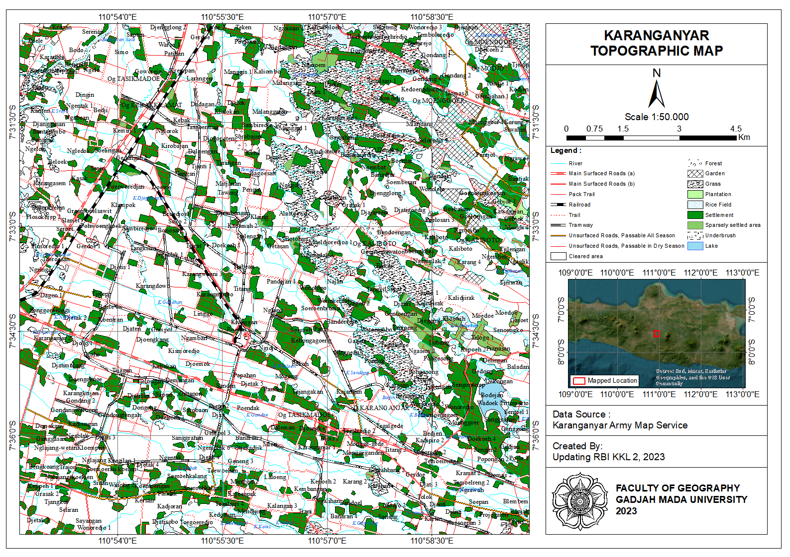
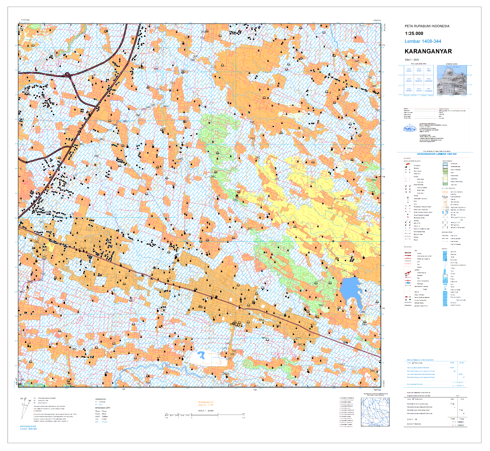

# RBI Map Updating and Historical Map Digitization

## Overview
This project focuses on the synchronization of Indonesian topographic data by updating the RBI Map and preserving historical geographic records. It aims to bridge the gap between geographic data and current land conditions by utilizing 2023 high-resolution satellite imagery for modern updates and scanned raster maps for historical digitalization.

## Objectives
- Update RBI maps by digitizing the latest 2023 satellite imagery
- Vectorize historical maps by converting scanned raster data into shapefiles

## Study Area
Karaganyar Regency, Central Java, Indonesia

## Software
- ArcGIS
- QGIS
- ArcSurvey123

## Methodology
The methodology follows two distinct workflows to ensure data continuity and accuracy. For the RBI update, 2023 high-resolution satellite imagery was used for systematic on-screen digitizing to reflect current topographic changes. Simultaneously, the historical mapping component involved the georeferencing and vectorization of scanned raster maps directly into structured shapefiles. Both datasets then underwent rigorous field validation to verify the digitized features against actual ground conditions, followed by a final topology check to maintain spatial consistency and data integrity.

## Results
- RBI map update (Karanganyar and Karangpandan sheets)
- Digital file of AMS Produced Map (Karanganyar and Karangpandan sheets)
- Digital file of Netherland Produced Map (Karanganyar and Karangpandan sheets)
- Toponym (Geographical name history) collection

## Map Preview

  
  &nbsp; &nbsp;
  
   
  <em>Historical Map & RBI Map Updating</em>

## Academic Context
This project was conducted by the Updating RBI Team under the supervision of faculty lecturers as part of the 2023 Fieldwork Course, Department of Geographic Information Science, Universitas Gadjah Mada.

## Author
Aisyah Nasywa Talitha (GIS and Remote Sensing Enthusiast) 🤝Big thanks to my 16 teammates during our fieldwork!