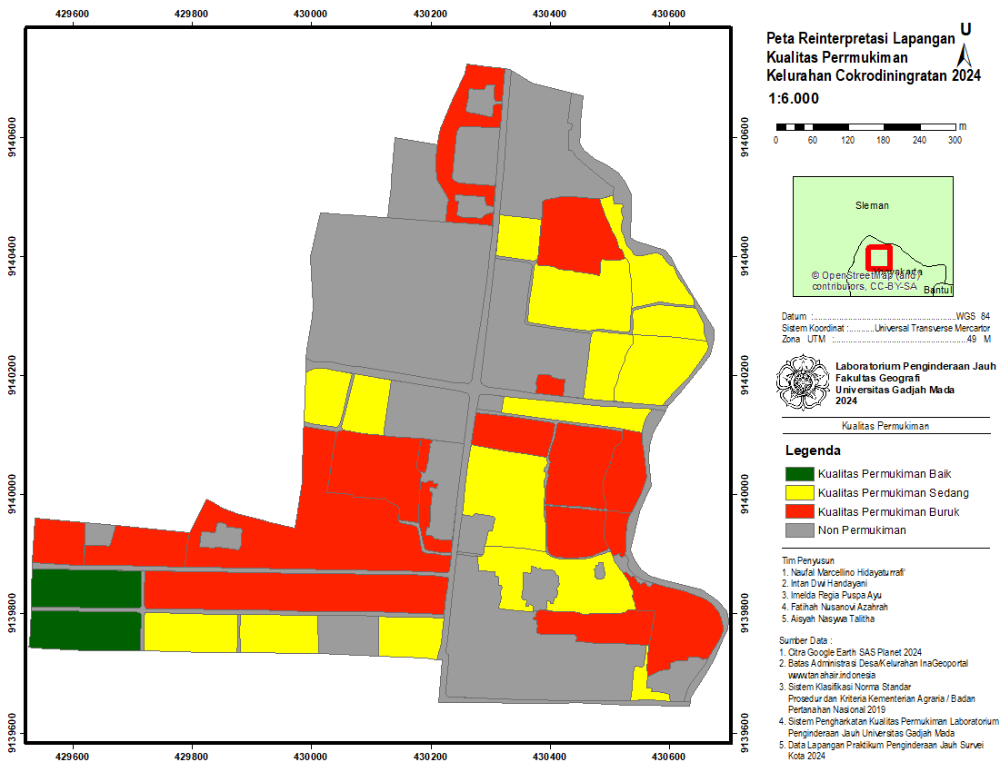

# Settlement Quality and Population Mapping

## Overview
Project focuses on the spatial mapping of settlement quality and population density estimation through a combination of remote sensing analysis and field validation. The project use roof-count method to estimate the population, while the settlement quality use multiple variables that affect the quality of housing.

## Objectives
- Estimate the population and map the population density
- Map settlement quality

## Study Area
Cokrodiningratan Village, Special Region of Yogyakarta, Indonesia

## Software
- ENVI
- ArcGIS

## Methodology
This project integrates remote sensing and GIS techniques with field-based verification to assess settlement characteristics. The process began with laboratory analysis, where settlement quality was evaluated based on multiple physical variables, followed by a manual rooftop digitization to mathematically estimate population density. To ensure data accuracy, field validation was conducted to cross-reference laboratory findings with real-world conditions. The final stage involved a comprehensive re-interpretation and calculation of the spatial data.

## Results
- Settlement quality map
- Housing type map
- Population density map

## Map Preview

## Academic Context
This project was developed as a collaborative final assignment for Urban Remote Sensing Survey Laboratory Course at Universitas Gadjah Mada.

## Author
Aisyah Nasywa Talitha (GIS and Remote Sensing Enthusiast) 🤝Big thanks to my teammates: Marcel, Intan, Puspa, and Novi for the collaborations!